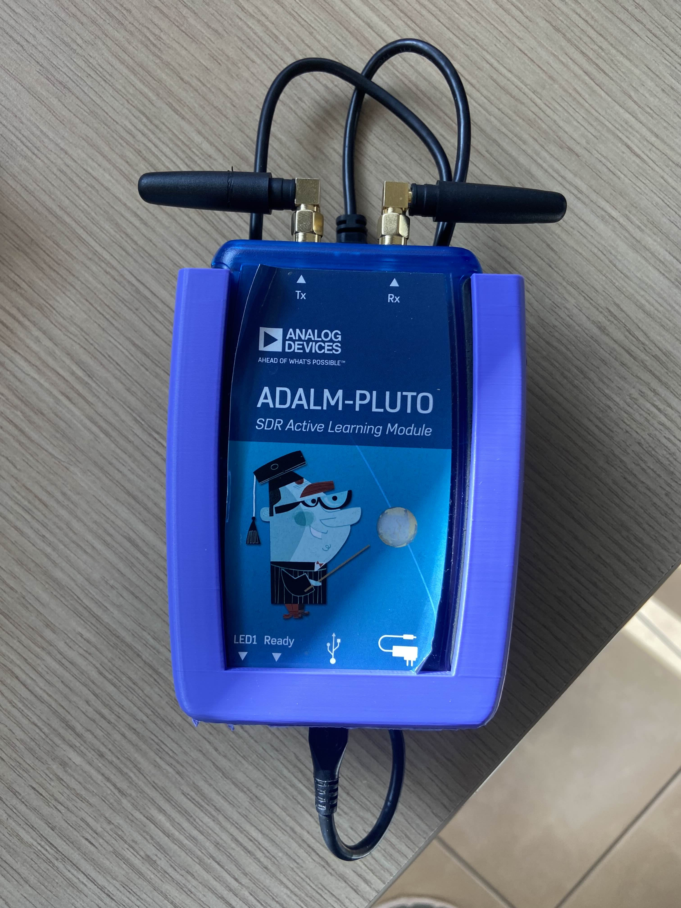
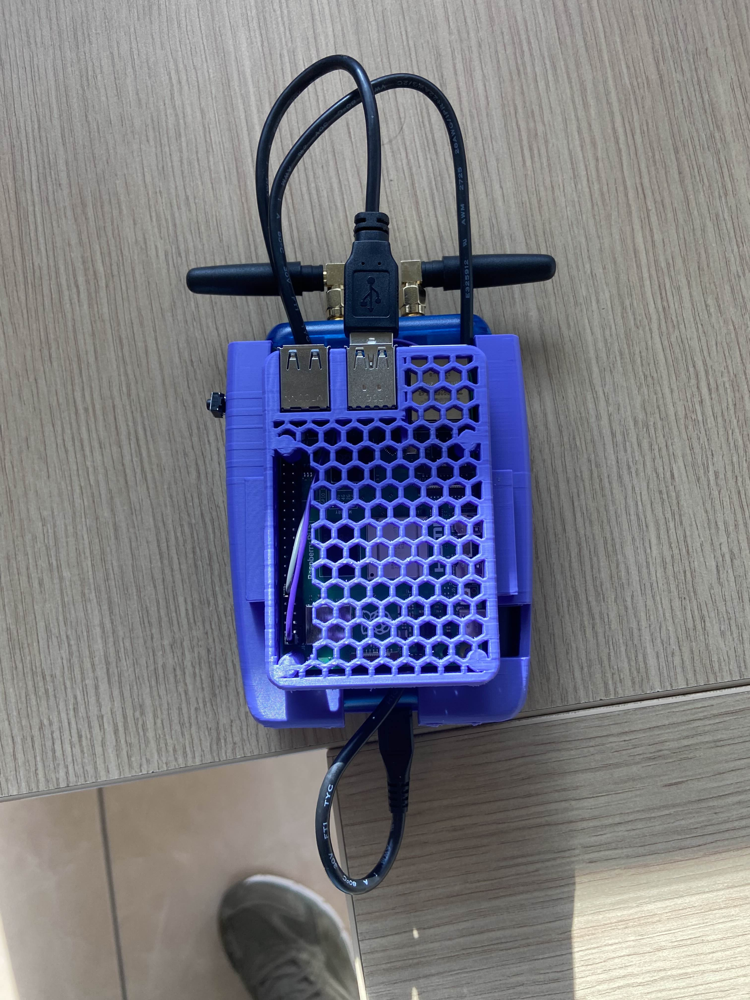
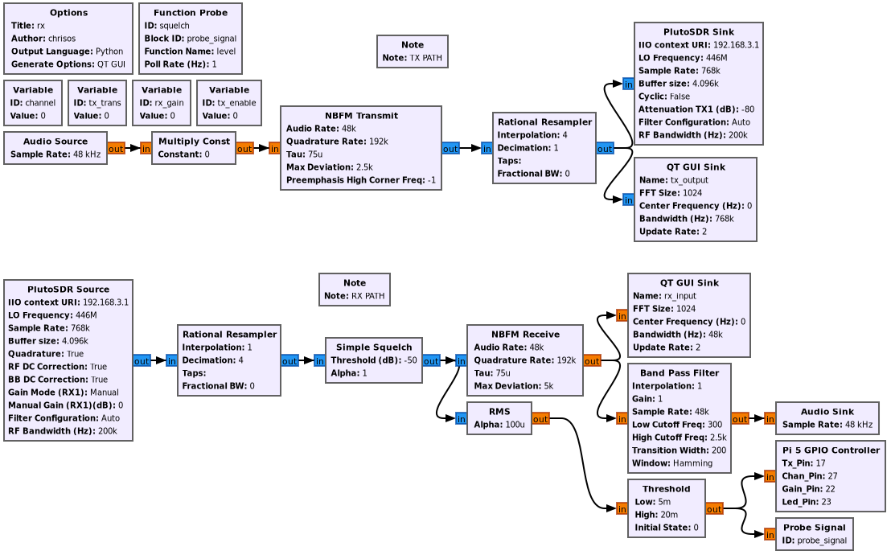

# Franken-Radio-5000

Welcome to the **Franken-Radio-5000**! This project turns a Raspberry Pi 5 and an Analog Devices ADALM-PLUTO Software Defined Radio (SDR) into a fully functional DIY walkie-talkie. Encased in a custom 3D-printed honeycomb shell, this rig transmits and receives Narrowband FM (NBFM) on the PMR446 band.




## 📡 Features

* **NBFM Transceiver**: Operates at a base frequency of 446 MHz.
* **Physical Controls**: Uses a custom GNU Radio Embedded Python block to interface with the Pi's GPIO pins for tactile control.
* **Push-To-Talk (PTT)**: Momentary transmit button.
* **Channel Switching**: Single click forward or double click backward to cycle through channel offsets (0 Hz, 12.5 kHz, 25 kHz).
* **RX Gain Control**: Single click up or double click down to adjust the SDR's receive gain (4, 8, 16, 32, 64).
* **Status LED**: Automatically illuminates when actively transmitting or receiving a signal over the RMS threshold.



## 🛠️ Hardware Requirements

* **Raspberry Pi 5** (The brains)
* **ADALM-PLUTO SDR** (The RF muscle)
* **Custom 3D Printed Case** (Check the repo for the G code)
* **Antennas** (x2 for TX/RX on the Pluto)
* **Push Buttons** (x3 for TX, Channel, and Gain)
* **LED** (x1 for status indication)
* **USB Audio Device / Headset** (For mic input and 48kHz audio output)

## 🔌 GPIO Wiring / Pinout

Wire your physical components to the Raspberry Pi 5 as follows (using BCM numbering):

* **TX (PTT) Button**: GPIO 17
* **Channel Button**: GPIO 27
* **Gain Button**: GPIO 22 
* **Status LED**: GPIO 23

*Note: The code initializes the button pins as inputs with internal pull-down resistors (`pull_up_down=GPIO.PUD_DOWN`). Connect the other side of your buttons to a 3.3V pin so they pull HIGH when pressed.*

## 💻 Software Dependencies

* **GNU Radio** (Built with version 3.10.12.0)
* **gr-iio** (For the ADALM-PLUTO source and sink blocks)
* **RPi.GPIO** (For hardware button polling)
* **NumPy** (For RMS audio calculations)

## 🚀 How to Run

1. Ensure all dependencies are installed on your Raspberry Pi 5.
2. Connect your hardware buttons and LED according to the pinout above.
3. Plug in the ADALM-PLUTO via USB.
4. Plug in your audio headset.
5. Open `walkie_talkie.grc` in GNU Radio Companion.
6. Click **Execute/Run** (or run the generated Python script directly via `python -u walkie_talkie_pi.py`).
7. Press the PTT button and start talking!

**P.S: For the Raspberry Version it is needed to first generate the .py script and then add bellow the embedded python block the following line :**

``` 
self.epy_block_0.parent = self
```

In case of one or none Raspberry Pi avaliable, there is also a computer version to run! Have Fun! 